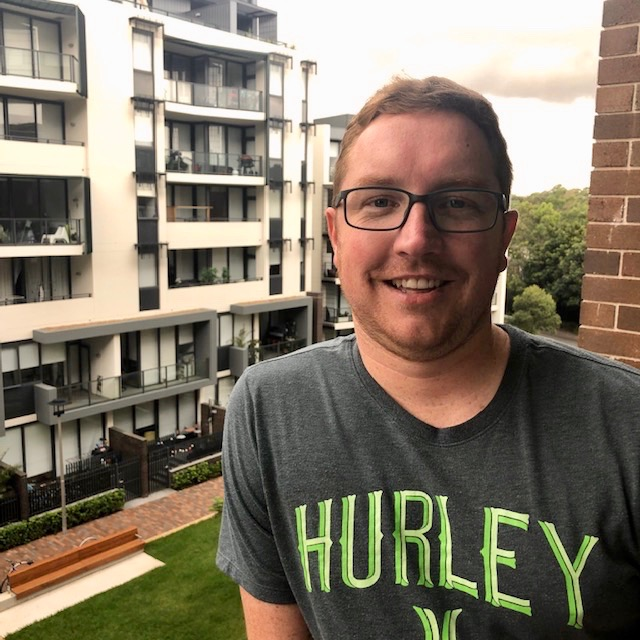

# Welcome to my profile

## Personal Information: 

- Name: Aaron Bowden
- Student Number: S3778882 
- Email Address: s3778882@student.rmit.edu.au
- Nationality: Australian 
- Education: NSW School Certificate, Diploma of International Retail Travel and a Diploma of Business Management
- Languages Spoken: English
- Fun Fact: I am a snowboarder and scuba diver 
- Favourite Sport: Formula 1 

## Interest in IT: 

I have always had a curious mind and strong sense of imagination. I developed a keen interest in information and technology from a young age, as my father was an Aeronautical Engineer for Boeing. He exposed me to the hard work, dedication and life long training and re-training that is required to work in an innovative, technology driven space. As an adult, I have always been attracted to careers or companies that require the ability to think outside the box and reward creativity and individualism. In 2016, I applied for a job with Apple and was fortunate enough to be offered a position  in 2017 as a Technical Advisor. 

## Experience in IT: 

I have been working for Apple for the past two years. In my current role, I provide technical support to clients from around the world. I have developed advanced communication skills as well as a sophisticated understanding of troubleshooting and diagnostics, allowing me to explain complex technical issues to non-technical persons. My work mostly takes place over the phone with the use of tools such as screen sharing to guide clients through their technical issues. While working for Apple, I have completed a number of job specific training courses to qualify me to provide technical support across a suite of Apple products, focussing on software. I have also completed a variety of other courses at Apple in areas such as compliance, privacy and security. 

## Why RMIT: 

For sometime I have considered enrolling in tertiary studies to expand my career prospects and enhance my understanding of IT. Given I live in Sydney and have a busy life managing full time work, family and travel, it was important to me that I could have the flexibility of studying online. I did some research through Open Universities Australia and discovered the program offered by RMIT. The course appealed to me as it purports to teach a desirable combination of theory and technical skills. I was also drawn to RMIT because of its reputation for excellence. I have heard through word of mouth that other students have had a positive experience studying this course. 

## What I Expect to Learn: 

I have high expectations for my professional development through undertaking this course. Firstly, I hope to expand my knowledge of the IT space, while developing industry connections. My current IT experience has been focused entirely on Apple, so I hope to expand my knowledge of other companies, platforms and systems to diversify my understating of the technology landscape. Secondly, I hope to develop more practical IT skills in areas such as  programming and development. As I progress in my IT career, I aim to graduate from the technical support space to a more creative and technical role such as software engineering. I hope this degree will allow me to bridge the gap between my existing skills and experience, and what is required to achieve my future career goals.  Finally, I hope to develop additional skills in writing, research and analysis through exposure to academic tasks and practices. 

## The Ideal Job: 

[https://jobs.apple.com/en-au/details/200023037/software-engineer?team=SFTWR](https://jobs.apple.com/en-au/details/200023037/software-engineer?team=SFTWR)

or alternatively [here](https://nbviewer.jupyter.org/github/aaron-bowden/aaron-bowden.github.io/blob/master/Software%20Engineer%20-%20Apple%20%28AU%29.pdf)

## What is this position and why is it appealing: 

My ideal job is a Software Engineer with Apple. The link above currently advertises a Software Engineer role with the data security team. This position involves building novel crypto and security products. It is targeted at software engineers who have a passion for dealing with security challenges to help keep Apple data, services and interactions safe and private. This position appeals to me as this role emphasises innovation and collaboration. The role is very technical, requiring excellent programming skills and a good understanding of security concepts and design patterns. While the role is beyond my current skills and qualifications, it is something I would like to work towards. 

## What skills, qualifications and experience are required for the position: 

This role requires a tertiary education such as a bachelor, master or doctoral degree in computer science or equivalent experience. The additional skills required focus around cryptography and security. Importantly, there is a need to understand modern cryptography concepts and the design of secure systems. There is a need to understand distributed system security, authentication and access controls. Technical skills include strong programming skills and the ability to use C++, Go, Java and OOP concepts. 

## What skills, qualifications and experiences I currently have: 

While I currently have two years experience working for Apple in a technical support role, I do not have the tertiary education or technical knowledge and experience required for my ideal role. I do however have an excellent understanding of the variety of hardware and software products offered by Apple. I also have experience in Apple’s privacy and data security protocols. I am passionate about data privacy and security and seek to educate and assist clients in my current role to help them protect their information. 

## My plan to obtain the skills and experience relevant to this position: 

I am aware that I have a large skills gap between my current position at Apple and my ideal position as a Software Engineer. I am however extremely motivated to obtain the skills, knowledge and experience necessary to apply for this type of position in the future. I believe the fact that I am already employed at Apple will assist me in working towards this position. Being an existing employee, I am privy to company operations and information and can continue to build my experience within the organisation. I aim to utilise my internal networks to identify training programs and mentors that may assist in my professional development. I have spoken with my manager and explained my career ambitions and have received company support to undertake the Bachelor of IT at RMIT. Having a tertiary qualification is a key component of my ideal role, and I believe the skills and knowledge I will learn at university will complement my employment experience to work towards my dream role. 
